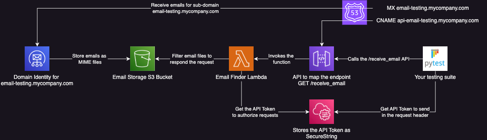

# Automated Email Testing using AWS SES, S3, Lambda, and API Gateway

If your application send emails it's important to test them. Testing emails include verifying recipient, subject, body, and attachments. E-mail testing is challenging because it's not as trivial as testing code in your app. Tools like Mailosaur and Mailtrap provide a huge amount of features to help you with your testing. However, these tools are to some degree expensive depending on your current available budget. If you don't need a blasting expensive e-mail testing tool, this AWS solution might be suitable for you.

## The Problem

How can you verify the e-mails sent from your application contain correct recipient, subject, body, and attachments in an automated way? Let's say you have an integration test pipeline which runs every time you push changes to the codebase. Basically we want a method like the `wait_receive_email` below to fetch the new emails for us. Notice in the code below that `start_time` is used to filter for emails sent after your test started.

```python
def test_send_email():
    start_time = time.time()
    recipient = "test_send_email@email-testing.mycompany.com"
    send_welcome_email_to_user(recipient)

    # We want a method like this to fetch the email
    email = wait_receive_email(recipient, start_time)

    assert email['To'] == recipient
    assert email['Subject'] == "Welcome to My Company"
    assert email['TEXTBody'] == "Welcome to My Company! We are glad to have you here."
```

A cross-language simple way to implement this solution is by providing it via a simple REST API. The code below presents what we expect the interface of this API to look like. Notice we also include an `Authorization` header in the API to make it private only for the internal testing.

```python
def wait_receive_email(recipient, start_time):
    response = requests.get(
        url="https://api-email-testing.mycompany.com/receive_email",
        params={
            "recipient": recipient,
            "utcReceivedAfter": start_time.strftime("%Y-%m-%dT%H:%M:%S.%fZ")
        },
        headers={
            "Authorization": "Bearer <api_key>"
        })
    return response.json()
```

## The Solution

The solution proposed here is fully AWS compliant, it uses the following components: SES, S3, Lambda, API Gateway, Parameter Store, and Route 53. The architecture is presented in the diagram below.



## Running the project

The lambda function was developed in Go and to compile it this project is using Docker. This is so because for MacOS and
Windows users the go binary has to be generated for linux compatible images, so it can run in lambda linux. Make sure you
have Docker installed and running on your machine.

Terraform apply it might fail in the middle of the process because it takes some time to verify the ACM certificate. If
that happens, wait a minute, and then run the command again.

```shell
# Check docker is running
docker --version

# Set the environment variables
export AWS_REGION=<your_region>
export AWS_ACCESS_KEY_ID=<your_access_key>
export AWS_SECRET_ACCESS_KEY=<your_secret_key>
export ROUTE_53_ZONE_ID=<your_zone_id>
export ROUTE_53_DOMAIN_NAME=<your_domain_name>

# Deploy project in AWS
cd terraform

terraform init

terraform apply \
  -var route53_zone="$ROUTE_53_ZONE_ID" \
  -var route53_domain_name="$ROUTE_53_DOMAIN_NAME" \
  -var aws_region="$AWS_REGION"
  
# Test the application is working
cd ..

pip install -r requirements.txt

python test_email.py

# Delete the resources
cd terraform

terraform destroy \
  -var route53_zone="$ROUTE_53_ZONE_ID" \
  -var route53_domain_name="$ROUTE_53_DOMAIN_NAME" \
  -var aws_region="$AWS_REGION"
```

If all steps are completed successfully, you should see the following output:

```
Start by sending an e-mail from your personal Gmail (or another e-mail provider) to the following address: test-user@email-testing.youraddress.com
Have you sent the e-mail? (yes/no): yes
From: my-email@gmail.com
To: test-user@email-testing.youraddress.com
Date: Wed, 04 Sep 2024 20:05:51 -0700
Subject: Test Subject
Size: 4810
Attachments: 0
Body Text: Test Body
Body HTML: <div dir=3D"ltr"><br clear=3D"all"><div>Test Body</div>...
```
